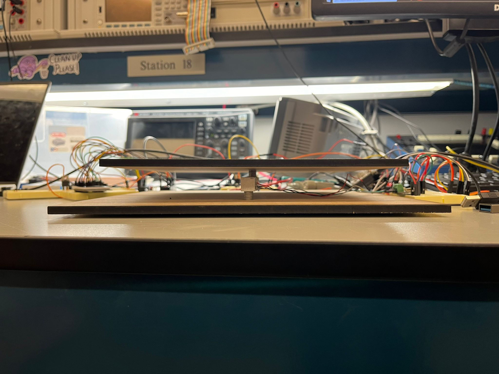
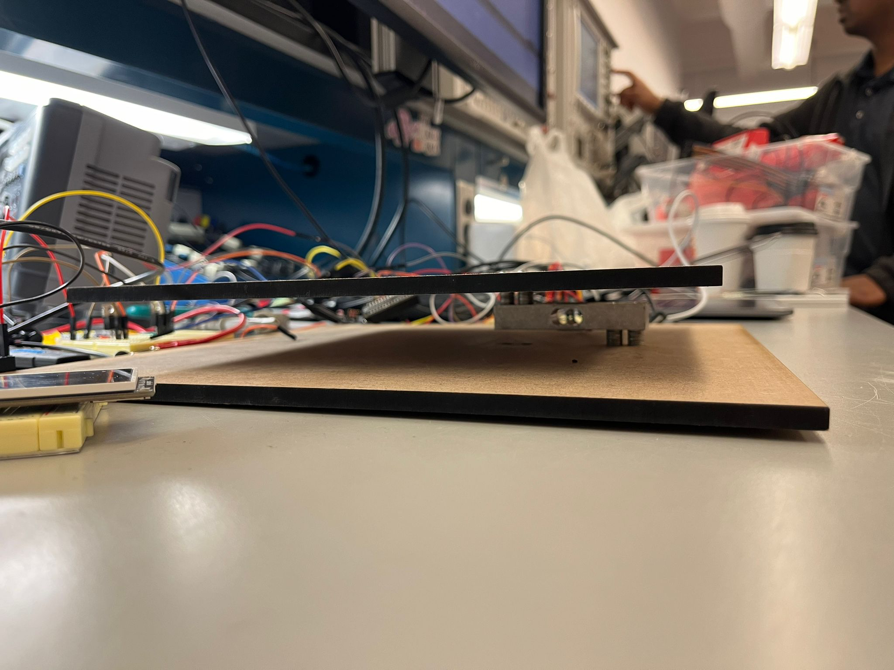

# final-project-skeleton

    * Team Name: Swiper, no Swiping!
    * Team Members: Soyoon Park, Maryam Ali
    * Github Repository URL: https://github.com/ese3500/final-project-maryam-soyoon
    * Github Pages Website URL: https://ese3500.github.io/final-project-maryam-soyoon/
    * Description of hardware: (embedded hardware, laptop, etc)

## Final Project Proposal

### 1. Abstract

In a few sentences, describe your final project. This abstract will be used as the description in the evaluation survey forms.

Our project is an anti-theft tool used to allow homeowners to add a layer of security for packages delivered to their homes. By simply putting our system on their front porch, homeowners can monitor and log the status of package delivery and retrieval; unauthorized retrieval (i.e. thieves) will trigger the alarm.

### 2. Motivation

What is the problem that you are trying to solve? Why is this project interesting? What is the intended purpose?

Packages are stolen from people’s doorsteps often. A statistic from CapitalOne mentions that > 75% of people in the United States were victim to this in 2023 alone. However, manned security or lockers are not an available option for everyone, not to mention the latter limits the size of the package applicable. Our project presents a cost-effective, space-efficient, and approachable solution to this problem.

### 3. Goals

These are to help guide and direct your progress.

1. Successfully be able to detect pressure (or weight) using a Load Cell to determine when a package is dropped off and picked up.

2. Assemble a platform with two wooden plates to attach to the Load Cell. This is to allow for accurate weight detection. We also intend to (hopefully) calibrate Load Cell with plate weight.

3. We may add an Ultrasonic Sensor (or multiple) as a secondary validation check for package movement. We are more likely to use this for saving power for our LCD Screen, only turning it on and prompting users for input once we detect nearby motion.

4. Store timestamps regaridng package delivery and retrieval with a Real Time Clock.

5. Notify user through WiFi module & Blynk application (or email?) and potentially add some two factor authentication, allowing users to confirm whether they were the ones to pick up the package or manually disable the alarm system.

6. Incorporate a keypad for manual proof that homeowner picked it up (enter a password that turns off the alarm).

7. Distinguish between proper package retrieval (based on owner input) and package theft

8. Store data to an SD Card formatted as Date/Time, Package Weight, Authorized or not?
   Alarm system? ss a safety mechanism. The actual formatting is likely to change.

9. Take photos usinga a camera when a weight difference is detected.

- Can be used as evidence for police investigation

10. Additional feature: upon user input on expected delivery date & time, notify owner if expected package was not delivered

### 4. Software Requirements Specification (SRS)

Formulate key software requirements here.

1. Overview

Our project shall have bare metal components which will be used to work with the Load Cell and communicate using SPI with the SD Card and using I2C with the Load Cell Amplifier. It will also include Arduino code for communicating wirelessly with homeowners using the Blynk application and for our two-factor authentication feature.

2. Users

Our intended users are homeowners who wish to safeguard their packages against theft. It is intended for non-technical audiences as this is an at-home device.

3. Functionality

1. SRS 01 – Package movement (placement and picking up) will be detected using pin change interrupts with the DRDY pin on the Load Cell ADC.

1. SRS 02 – ADC will be used to read from the SDA line of the Load Cell ADC to determine package weight.

    - Meets ADC requirement

3. SRS 03 – Package movement interrupt will turn on the Camera peripheral and stored to the SD Card (later on it may be sent to the homeowner)

    - Meets SPI (Serial Communication) requirement

4. SRS 04 – Two-factor authentication set up with Blynk so that homeowners can verify that package removal was their doing.

   - Meets wireless communication requirement

5. SRS 05 – PWM used to set off the alarm system to fend off any thieves that is turned off using two-factor authentication (unless already indicated in app) or already typed into keypad and picked up within reasonable time frame (e.g. 1 minute)

   - Meets timers requirement

6. SRS 06 – SPI Driver will be used to write data to (and read from) the SD Card.

7. SRS 07 – Maybe nice UI for Blynk!

### 5. Hardware Requirements Specification (HRS)

Formulate key hardware requirements here.

1. Overview

Our device uses Load Cells to measure weights and detect packages, SD cards to store histories for later use by homeowners, an LCD screen will prompt users to enter passwords up to 3 times with error alongside a keypad, and a camera to take snapshots at critical times.

2. Functionality

1. HRS 01 – Our system shall use two ATmega328PB microcontrollers. One will handle the Load Cell, LCD Screen, and keypad.

1. HRS 02 – Our system shall be powered using 5 V Battery packs, which will power both ATmega328PBs

    - Meets power management requirement

3. HRS 03 – The Load Cell will be used to detect packages being dropped off and picked up, with the expected range of up to 20kg.

4. HRS 04 – An SD Card will be used to keep track of information during critical events (e.g. package delivery, package pick-up, package authorization)

5. HRS 05 – A 4-numbered keypad will be used to allow people to disable the alarm system by entering a passcode (length = 3?). If not, the alarms will sound at a high volume to notify homeowners inside (and maybe send a message) that the package has been picked up. Passwords can be entered up to 3 times until the alarm goes off, after which they will need to wait another minute to try again.

6. HRS 06 – Cameras will take snapshots at time critical moments (like package picked up, dropped off), which will be stored to the SD card alongside the timestamp.

7. HRS 07 – Ultrasonic sensors will be able to detect when a person is nearby to turn the LCD screen on (power saving). They drive a pin high which turns on a MOSFET that turns on the LCD screen.

8. HRS 08 – Buzzers will be used to sound an alarm system. They can be disabled if the correct password is entered on the keypad beforehand.

### 6. MVP Demo

What do you expect to accomplish by the first milestone?

- An SPI Driver written to write to SD Card

- Write delivery & retrieval log to the SD Card: Store timestamp with RTC, weight of package, etc.

- Load Cell calibrated with package weight included potentially and measuring accurate weight values using ADC and the ATmega328 PB

- LCD Screen and keypad working to disable alarm system for a set time

### 7. Final Demo

What do you expect to achieve by the final demonstration or after milestone 1?

- Have camera take pictures and write to SD Card

- WiFi and Blynk set up

### 8. Methodology

What is your approach to the problem?

We will tackle this project in modules, e.g. Load Cell, Keypad and alarms, LCD Screen, Camera, SD Card, etc. These modules are categorized based on the main hardware that our system uses. Additionally, we will handle the most crucial systems first, namely the Load Cell and the alarm system and will save time later for the wireless communication (Blynk). So, that way we have some working version of our project by Milestone 1, or at least earlier on.

### 9. Components

What major components do you need and why?

1. Load Cell -> Weight measurement for package detection

2. Camera -> Take photos of the package and person potentially

3. Buzzer -> Sounds the alarms if password is incorrect >= 3 times (can be manually disabled)

4. Ultrasonic sensor -> To detect when someone is near the keypad to turn the LCD screen on

5. LCD Screen -> Prompts user for input and notifies if password is correct or not
   SD Card and SPI board -> To store histories and help people track

6. 2 ATmega328 PBs -> Microcontrollers managing different systems

### 10. Evaluation

What is your metric for evaluating how well your product/solution solves the problem? Think critically on this section. Having a boolean metric such as “it works” is not very useful. This is akin to making a speaker and if it emits sound, albeit however terrible and ear wrenching, declare this a success.
It is recommended that your project be something that you can take pride in. Oftentimes in interviews, you will be asked to talk about projects you have worked on.

We have multple criterion for success based on our different features:

1. We would want to see that packages of suitable weights can be detected. This range will depend on the Load Cells we purchase, although may be in the range of 1-15 kg.

2. Keypad functionality:

- Inputting an incorrect password >= 3 times should disable the keypad for ~1 minute

- Inputting an incorrect password does not disable alarms. So, picking up the package should sound the alarm system that notifies the homeowner and can only be disabled via the app (or maybe reentry of correct passcode)

- Inputting a correct password does disable alarms. So, lifting the package within a time frame (e.g. 1 minute) should not cause the alarms to go off.

3. LCD Screen

- Somewhat aesthetic (but mainly readable) interface for user to see prompt and enter response.

4. Data Storage

- Reliable storage of timestamps, photos, and useful notes for the homeowner. The exact details of what data we will be storing are currently unclear.

### 11. Timeline

This section is to help guide your progress over the next few weeks. Feel free to adjust and edit the table below to something that would be useful to you. Really think about what you want to accomplish by the first milestone.

| **Week**            | **Task** | **Assigned To** |
| ------------------- | -------- | --------------- |
| Week 1: 3/24 - 3/31 |          |                 |
| Week 2: 4/1 - 4/7   |          |                 |
| Week 3: 4/8 - 4/14  |          |                 |
| Week 4: 4/15 - 4/21 |          |                 |
| Week 5: 4/22 - 4/26 |          |                 |

Tasks for Week 1:

- Present slideshow -> Maryam and Soyoon

- Send in first draft of BOM to be ordered -> Maryam and Soyoon

- Make project diagram (pinout, power management) -> Maryam

- Start working on SPI (and I2C?) driver -> Maryam

- Start working on Keypad code / library -> Soyoon

- Work on load cell ADC library -> Soyoon?

Tasks for Week 2:

- Work on tasks missed in Week 1 -> Maryam and Soyoon

- Go to MEAM Labs to figure out load cell platform -> Maryam and Syoon

- Calibrate and read ADC Values from Load Cell -> Soyoon

- Add LCD Graphics and integrate with Keypad code -> Maryam

- Get ultrasonic to detect distances <= 20 cm -> Maryam and Soyoon

- Send in second draft of BOM -> Maryam and Soyoon

Tasks for Week 3:

- Work on tasks missed in Week 2 -> Maryam and Soyoon

- Work in integrating second ATmega -> TBD

- Work on data storage and SD Card -> TBD

- Work on camera -> TBD

Tasks for Week 4:

- Work on tasks missed in Week 3 -> Maryam and Soyoon

- Work on wireless WiFi stuff and Blynk -> TBD

- Test out full alarm system (password + all possible cases + disabling with WiFi) -> Maryam and Soyoon

Tasks for Week 5:

- Work on tasks missed in Week 4 and wrapping up! -> Maryam and Soyoon

### 12. Proposal Presentation

Add your slides to the Final Project Proposal slide deck in the Google Drive.

Link to slides: https://docs.google.com/presentation/d/1zIqGlrjKZ0dEqcT9n2PsBiyORt0Xb7s5zlAwpfT2L5Y/edit?usp=sharing

## Final Project Report

Don't forget to make the GitHub pages public website!
If you’ve never made a Github pages website before, you can follow this webpage (though, substitute your final project repository for the Github username one in the quickstart guide): <https://docs.github.com/en/pages/quickstart>

### 1. Video

Link to video: https://drive.google.com/file/d/1_-ESJ4E6aS7UAE-A8OpvkmLZ8wjy9N1o/view?usp=sharing

### 2. Images

Load Cell wedged between two wooden plates.

Top view of platform. Other components visible (LCD screen, keypad, buzzer, MOSFETs, NAU7802 (ADC), RTC, ESP32, ATMega328PB).

Zoomed in set-up.

### 3. Results

What were your results? Namely, what was the final solution/design to your problem?

Our final product was a load cell wedged between two wooden plates, connected to a 24-bit ADC and a Real-Time Clock over I2C, a password-based alarm system, and a wireless data logging feature. Our product was able to successfully detect packages being put down and picked up, and put the corresponding package action information into the data log, as well as pull timestamps from the Real-Time Clock. The buzzer would go off if a package was picked up in an unauthorized manner and be disabled using the password.

We intended for our product to give homeowners a greater sense of security in terms of package delivery to their homes. Through the alarm system and data logging feature, we believe that this deviced helped take a step towards our goal of added package security. Our solution is not a fool-proof system, of course, and with the additon of a camera and two-factor authentication, we could further add layers of security to our project that would make it more useful in the real world. We would also ideally need to find a way to bolt it down to people's porches and conceal the inner electronics.

#### 3.1 Software Requirements Specification (SRS) Results

Based on your quantified system performance, comment on how you achieved or fell short of your expected software requirements. You should be quantifying this, using measurement tools to collect data.

Our SRS are as follows:

- SRS 01 – Package movement (placement and picking up) will be detected using pin change interrupts with the DRDY pin on the Load Cell ADC.

  - DONE - We ended up not using the DRDY pin, but alternately, a bit in one of the registers that would tell us if data was ready. In the end, we were able to detect packages at least as light as Maryam's iPhone.

- SRS 02 – ADC will be used to read from the SDA line of the Load Cell ADC to determine package weight.

  - DONE - We were successfully able to get data from the data line of the I2C and use these numbers in determining whether a package was put down or picked up.

- SRS 03 – Package movement interrupt will turn on the Camera peripheral and stored to the SD Card (later on it may be sent to the homeowner)

  - NOT DONE - We did not incorporate the camera.

- SRS 04 – Two-factor authentication set up with Blynk so that homeowners can verify that package removal was their doing.

  - NOT DONE - We did not incorporate two-factor authentication or Blynk.

- SRS 05 – PWM used to set off the alarm system to fend off any thieves that is turned off using two-factor authentication (unless already indicated in app) or already typed into keypad and picked up within reasonable time frame (e.g. 1 minute)

  - DONE - The alarm system worked and made sure that a user could only enter a password up to 3 times incorrectly before setting off the alarm. The alarm was also disabled for 30 seconds once a password was put in.

- SRS 06 – SPI Driver will be used to write data to (and read from) the SD Card.

  - NOT DONE - We did not use SPI and SD Card.

- SRS 07 – Maybe nice UI for Blynk!

  - NOT DONE - We did not incorporate Blynk.

#### 3.2 Hardware Requirements Specification (HRS) Results

Based on your quantified system performance, comment on how you achieved or fell short of your expected hardware requirements. You should be quantifying this, using measurement tools to collect data.

Our HRS are as follows:

- HRS 01 – Our system shall use two ATmega328PB microcontrollers. One will handle the Load Cell, LCD Screen, and keypad

  - DONE - Our implementation used 2 ATMegas, one for Keypad/LCD screen/Buzzer setup, and the other for the I2C and UART communication.

- HRS 02 – Our system shall be powered using 5 V Battery packs, which will power both ATmega328PBs

  - NOT DONE - We ended up not using a separate power source and instead used the computer cable connection to power the ATMegas

- HRS 03 – The Load Cell will be used to detect packages being dropped off and picked up, with the expected range of up to 20kg.

EDIT: The range is from an iPhone + case weight to (we expect) 20 kg.

  - DONE - We were able to detect packages as light as our phone. Larger weight packages would give even bigger ADC values and would definitely cross our threshold. We kept the packages light so as to not cause our load cell to bend too far and skew our threshold value, so we are assuming that it would successfully work for even heavier packages.

- HRS 04 – An SD Card will be used to keep track of information during critical events (e.g. package delivery, package pick-up, package authorization)

  - NOT DONE - As earlier mentioned, we did not use an SD Card and SPI and instead opted for a wireless datalogging mechanism, using ESP32.

- HRS 05 – A 4-numbered keypad will be used to allow people to disable the alarm system by entering a passcode (length = 3?). If not, the alarms will sound at a high volume to notify homeowners inside (and maybe send a message) that the package has been picked up. Passwords can be entered up to 3 times until the alarm goes off, after which they will need to wait another minute to try again.

  - DONE - We ended up using a 9-pin keypad and a buzzer. Our LCD/Keypad system allowed for errors up to 3 times, after which the timer went off. We also incorporated "clear" and "submit" functionality.

- HRS 06 – Cameras will take snapshots at time critical moments (like package picked up, dropped off), which will be stored to the SD card alongside the timestamp.

  - NOT DONE - We did not incorporate a camera or SD card

- HRS 07 – Ultrasonic sensors will be able to detect when a person is nearby to turn the LCD screen on (power saving). They drive a pin high which turns on a MOSFET that turns on the LCD screen.

  - NOT DONE - We did not use the ultrasonic sensor.

- HRS 08 – Buzzers will be used to sound an alarm system. They can be disabled if the correct password is entered on the keypad beforehand.

  - DONE - Our buzzer alarm system works and goes off if a package is picked up. It is disabled for 30 seconds if the correct password is put in.

### 4. Conclusion

Reflect on your project. Some questions to consider: What did you learn from it? What went well? What accomplishments are you proud of? What did you learn/gain from this experience? Did you have to change your approach? What could have been done differently? Did you encounter obstacles that you didn’t anticipate? What could be a next step for this project?

- Maryam: The biggest learning moment for me during this project was when working on the I2C driver for the Real-Time Clock and Load-Cell ADC sensor. I have used I2C libraries before that abstracted away many - if not all - of the underlying inter-device communication. Although it was extremely challenging, using tools like the logic analyzer and communicating with other students and TAs, helped me ultimately succeed in reading values from our 2 I2C devices. In the end, it was very rewarding to have gotten the I2C done, and I feel more comfortable looking at datasheets to figure out the serial communication. The ATMega-UART-ESP interfacing was more difficult than I was anticipating, and if not for side-by-side debugging with a graduate student, I wouldn't have been able to get the RTC data sent over to the ESP-32 in a readable format. Soyoon and I also did not anticipate the integration to be too difficult, because our ATMegas were mostly separated in terms of functionality and were communicating via pin change interrupts. However, we realized we oversimplified this step and that even getting the pin changes to work as intended was not as smooth as we thought. We probably should have started integration earlier instead of leaving it for the day before the demo.

- Soyoon: Soyoon worked with a 9-pin keyboard, which made use of many GPIO pins. Making room for all of the pins on a single ATMega and also making room for the LCD screen and buzzer was challenging, as well as managing the different device logic, such as when to turn the buzzer on, when to disable it, for how long, the keypad mechanism, etc.

A good next step for this project would be incorporating the camera for greater household security and, as suggested by Nick during our demo, potentially using the data logging feature into an app. The camera could be added to take photos at critical moments, such as when a package is being dropped off and when there is an unauthorized pickup. Sending these photos to the homeowner and storing them on an SD card would be a great addition to our data logging feature. The app would also potentially make notifications more immediate to homeowners, as they could get notifications throughout the day, rather than having to check the spreadsheet and go to the most recent entry.

## References

Fill in your references here as you work on your proposal and final submission. Describe any libraries used here.

- Sahil helped a lot with UART
- Mia helped with I2C
- NAU7802 Documentation and library used to set up our stuff
- ESP32 and

## Github Repo Submission Resources

You can remove this section if you don't need these references.

- [ESE5160 Example Repo Submission](https://github.com/ese5160/example-repository-submission)
- [Markdown Guide: Basic Syntax](https://www.markdownguide.org/basic-syntax/)
- [Adobe free video to gif converter](https://www.adobe.com/express/feature/video/convert/video-to-gif)
- [Curated list of example READMEs](https://github.com/matiassingers/awesome-readme)
- [VS Code](https://code.visualstudio.com/) is heavily recommended to develop code and handle Git commits
  - Code formatting and extension recommendation files come with this repository.
  - Ctrl+Shift+V will render the README.md (maybe not the images though)
